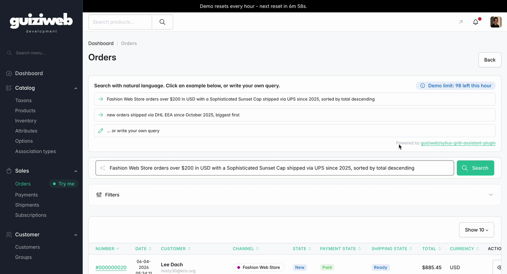

<p align="center">
    <a href="https://sylius.com" target="_blank">
        <picture>
          <source media="(prefers-color-scheme: dark)" srcset="https://media.sylius.com/sylius-logo-800-dark.png">
          <source media="(prefers-color-scheme: light)" srcset="https://media.sylius.com/sylius-logo-800.png">
          
        </picture>
    </a>
</p>

<h1 align="center">Sylius Grid Assistant Plugin</h1>

<p align="center">
    <a href="https://github.com/Guiziweb/GuiziwebSyliusGridAssistantPlugin/actions"></a>
    <a href="https://packagist.org/packages/guiziweb/sylius-grid-assistant-plugin"></a>
    <a href="https://packagist.org/packages/guiziweb/sylius-grid-assistant-plugin"></a>
    
    
    
    
    <a href="https://packagist.org/packages/guiziweb/sylius-grid-assistant-plugin"></a>
</p>

> **Natural language → filtered grid.** AI-powered filtering for Sylius admin grids.

## How it works

In an admin grid (orders, products, customers...), the assistant adds a search bar at the top. Type your query in plain language:

> *"orders over $100 from john.doe@gmail.com last month"*

The plugin sends the query to a Large Language Model (OpenAI, Gemini, Anthropic, Mistral...), gets back structured filters and sorting (JSON Schema strict), and redirects to the same grid with the filters applied - exactly as if you had clicked them manually.



## Requirements

- PHP ^8.2
- Sylius ^2.0
- An AI provider account (OpenAI, Gemini, Anthropic, Mistral...) and its API key

## Quick install

This plugin ships a [Symfony Flex recipe](https://github.com/Guiziweb/SyliusRecipes). With the Guiziweb recipe endpoint configured in your project (see linked repo), the install boils down to:

```bash
composer require guiziweb/sylius-grid-assistant-plugin
composer require symfony/ai-bundle symfony/ai-open-ai-platform  # or another bridge
```

Then fill in your API key in `.env.local` and enable the grids you want. The Flex recipes (plugin + bridge) take care of the rest (bundle registration, config files, env var stub).

Full step-by-step guide (with and without Flex): [installation](docs/installation.md).

## Documentation

- [Installation](docs/installation.md) - full setup steps
- [Usage](docs/usage.md) - admin guide with query examples
- [Extending](docs/extending.md) - add custom filter types

## License

MIT - see [LICENSE](LICENSE).
